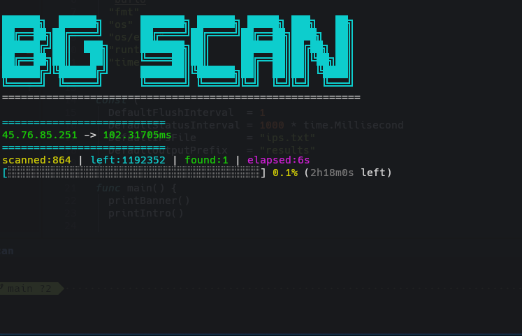

# 🚀 bgscan

> Ultra‑fast multi‑protocol scanner with a modular chained engine and interactive BubbleTea terminal UI.  
> Designed for developers and researchers who need speed, flexibility, and a modern scanning experience.

**bgscan** is a high‑performance scanning engine written in Go. It can run **multiple protocols in parallel** and **chain protocol stages** to build advanced detection workflows.  
It features an interactive **BubbleTea UI**, a modular execution pipeline, and an asset‑driven architecture that makes it easy to extend, customize, and integrate with external tools such as **Xray**, **DNSTT**, and **Slipstream**.

Built for performance, clarity, and extensibility.

---


---



# 📌 What is bgscan?

**bgscan** is a modular, multi‑protocol scanning engine with:

- ⚡ Concurrent pipeline architecture
- 🧠 Smart protocol detection & fallback
- 🌐 DNS tunneling & advanced DNS querying
- 🔐 Xray core integration
- 🧩 Asset‑driven extensibility
- 🎛 Interactive terminal UI (BubbleTea)
- 📦 Clean, validated config system
- 🗂 Robust result management & crash‑safe merging
- 🖥 Cross‑platform support

Ideal for developers, researchers, and power users who need a flexible scanner with a modern TUI.

---

# ✨ Features

## 🔹 Core Engine

- Worker‑pool–based scanning
- Stage / chain execution model
- Context‑aware cancellation
- Bounded, controllable concurrency
- Retry & fallback strategies
- IPv4 / IPv6 CIDR streaming
- Crash‑safe, atomic result merging

## 🔹 Supported Protocols

| Protocol   | Description                         |
| ---------- | ----------------------------------- |
| ICMP       | Ping‑based detection                |
| TCP        | TCP handshake scan                  |
| HTTP       | HTTP response validation            |
| DNS        | Advanced DNS querying with fallback |
| DNSTT      | DNS tunnel transport                |
| Slipstream | Slipstream probing                  |
| Xray       | Xray outbound verification          |

---

## 🔹 BubbleTea UI

Modern interactive terminal interface:

- Multi‑menu navigation
- Live config viewer
- Real‑time logs
- Status indicators
- Progress bars
- Styled components (Lipgloss)
- Keyboard‑driven operation

---

# 📦 Installation

### Download from Releases

```
https://github.com/MohsenBg/bgscaner/releases
```

Download the archive matching your platform.

---

## ▶️ Running bgscan

### 1️⃣ Extract the archive

Linux / macOS / Termux:

```bash
unzip bgscan-*.zip
```

Windows:

Right click → **Extract All**

---

### 2️⃣ Enter the extracted directory

```bash
cd bgscan-*
```

---

### 3️⃣ Run the binary

Linux / macOS / Termux:

```bash
./bgscan
```

Windows (PowerShell):

```powershell
.\bgscan.exe
```

---

# 📚 Documentation

Detailed documentation for **configuration files, scanning features, and integrations** is available in the `docs/` directory.

Start here:


[**Docs**](./docs/README.md)


The documentation includes:

- Configuration reference
- Protocol settings
- Writer system
- Xray integration
- Custom outbound configuration

---

# ⚙️ Settings

All configuration files are located in the `settings/` directory:

```text
settings/
├── dns_settings.toml
├── general_settings.toml
├── http_settings.toml
├── icmp_settings.toml
├── tcp_settings.toml
├── writer_settings.toml
└── xray_settings.toml
```


# 📂 Asset System

`bgscan` uses external runtime assets stored under `assets/`:

```text
assets/
  xray/
    outbounds/
      *.example
  dnstt-client/
  slipstream-client/
```


`bgscan` automatically loads `.json` outbound files at runtime.

---

# 🧠 Engine Architecture

```
CIDR Streamer
      ↓
   Stage Chain
      ↓
   Worker Pool
      ↓
 Protocol Runner
      ↓
  Result Writer
      ↓
  Atomic Merge
```

---

# 📊 Result System

- Asynchronous writer
- Buffered batching
- Atomic file replace
- `fsync`‑safe writes
- Duplicate filtering
- Structured output by protocol

Supported result types:

- ICMP
- TCP
- HTTP
- DNS
- DNSTT
- Slipstream
- Xray

---

# 🛠 Build (For Developers)

## Requirements

- Go **1.25.4+**
- Git
- Bash (Linux / macOS / WSL)

---

## Clone Repository

```bash
git clone https://github.com/MohsenBg/bgscaner.git
cd bgscaner
```

---

## Build

```bash
./build.sh
```

Outputs will be generated in:

```
dist/<version>/
```

---

# ❤️ Support the Project

If **bgscan** is useful for your work, consider supporting its development.

---

### 🟡 Bitcoin (BTC)

```
bc1q3c7cu36faxddjwc3h99k0vt82nj2m9t6u7tdfj
```

### 🟢 USDT (BEP20)

```
0x2ea5A8558B4250cCBF147b2E2501B086700f184A
```

### 🟡 BNB (BEP20)

```
0x2ea5A8558B4250cCBF147b2E2501B086700f184A
```

### 🔵 Ethereum (ERC20)

```
0x2ea5A8558B4250cCBF147b2E2501B086700f184A
```

### 🔴 TRON (TRX)

```
TVxmGjLfyDL3ArbdWk9F8Za24EDm1CHMF4
```

### 🟣 TON

```
UQDpsu6VBCbl31-LLKcAX8CUCD6BHzzVoHoM2clFJBsct8rq
```

---

# 🤝 Contributing

1. Fork the repository  
2. Create a feature branch  
3. Commit your changes  
4. Open a pull request

Guidelines:

- Write idiomatic Go
- Add GoDoc for exported types
- Keep concurrency safe and documented

---

# 📜 License

Released under the **MIT License**.

---

# 👨‍💻 Author

Developed and maintained by **MohsenBg**