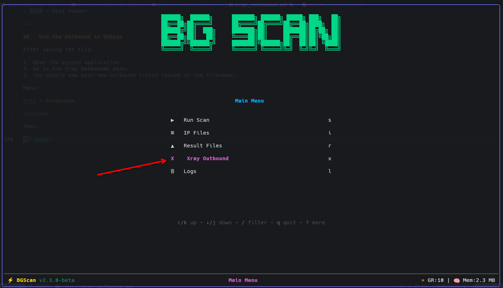
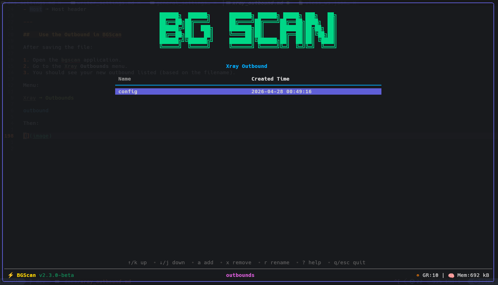

# Adding a Custom Xray Outbound

You can add your own Xray outbound configuration by following the steps below.

---

## 1️⃣ Navigate to the Outbounds Directory

All outbound templates are stored in:

```
assets/xray/outbounds/
```

Directory example:

```
assets/xray/outbounds/
├── vless_grpc.json.example
├── vless_ws.json.example
├── vless_ws_no_tls.json.example
├── vless_xhttp.json.example
└── vless_xhttp_no_tls.json.example
```

Files with the `.example` extension are templates.

---

## 2️⃣ Copy and Rename a Template

Choose a template (for example: `vless_ws.json.example`) and copy it:

```
cp vless_ws.json.example config.json
```

Updated directory:

```
assets/xray/outbounds/
├── vless_grpc.json.example
├── vless_ws.json.example
├── vless_ws_no_tls.json.example
├── vless_xhttp.json.example
├── vless_xhttp_no_tls.json.example
└── config.json
```

You can name the file anything you like (`my_ws.json`, `tls_ws.json`, etc.).

---

## 3️⃣ Edit the Configuration File

Open your file:

```
assets/xray/outbounds/config.json
```

Replace all fields marked with `?` using your real outbound values.

⚠️ Important:  
Do **not** edit:

```json
"address": "$ADDRESS"
```

The scanner replaces `$ADDRESS` automatically during testing.

---

### Example Template (Before Editing)

```json
{
  "tag": "proxy",
  "protocol": "vless",
  "settings": {
    "vnext": [
      {
        "address": "$ADDRESS",
        "port": 443,
        "users": [
          {
            "id": "?",
            "encryption": "none"
          }
        ]
      }
    ]
  },
  "streamSettings": {
    "network": "ws",
    "security": "tls",
    "tlsSettings": {
      "allowInsecure": false,
      "serverName": "?",
      "alpn": ["h2", "http/1.1"],
      "fingerprint": "firefox"
    },
    "wsSettings": {
      "path": "?",
      "headers": {
        "Host": "?"
      }
    }
  }
}
```

---

### Example (After Filling Values)

```json
{
  "tag": "proxy",
  "protocol": "vless",
  "settings": {
    "vnext": [
      {
        "address": "$ADDRESS",
        "port": 443,
        "users": [
          {
            "id": "3f1e6f4c-9f1c-4a3a-bf10-9e2c8a123456",
            "encryption": "none"
          }
        ]
      }
    ]
  },
  "streamSettings": {
    "network": "ws",
    "security": "tls",
    "tlsSettings": {
      "allowInsecure": false,
      "serverName": "example.com",
      "alpn": ["h2", "http/1.1"],
      "fingerprint": "firefox"
    },
    "wsSettings": {
      "path": "/ws",
      "headers": {
        "Host": "example.com"
      }
    }
  }
}
```

You must fill in:

- `id` → Your VLESS UUID  
- `serverName` → TLS SNI  
- `path` → WebSocket path  
- `Host` → Host header  

---

## 4️⃣ Using Your Outbound in BGScan

After saving the JSON file:

1. Open the **BGScan** application.  
2. Navigate to:

```
Xray → Outbounds
```



You should now see your new outbound listed.


